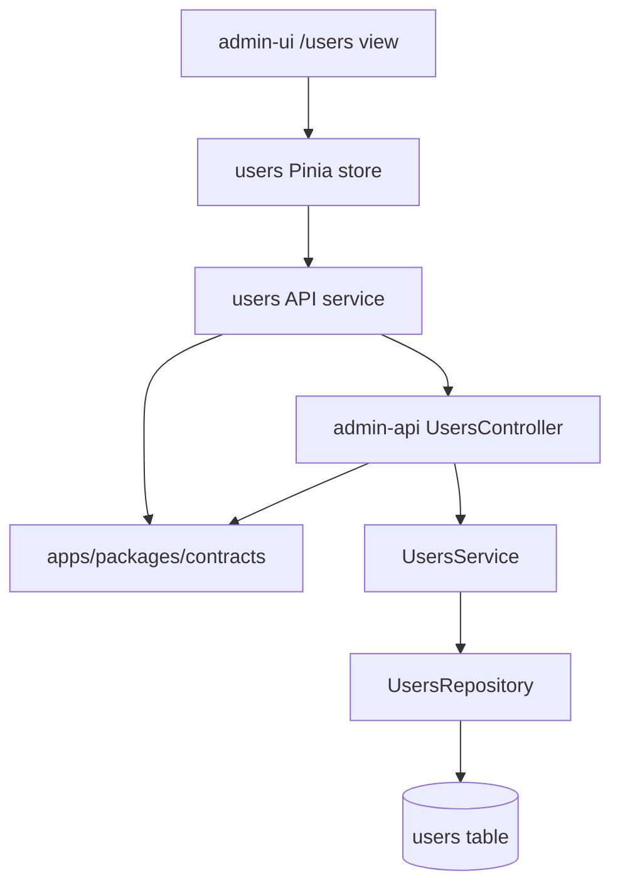

# CRUD de Usuarios Administradores - Design

**Spec**: `.specs/features/admin-users-crud/spec.md`
**Status**: Draft
**Scope**: Large

---

## Architecture Overview

The feature adds a shared contracts package, expands the existing `admin-api` users module, and builds the `/users` management screen in `admin-ui`. Contracts are the source of request/response shapes for both apps; the API owns business rules and persistence; the UI owns search normalization, modals, toast feedback, cursor navigation, and screen state.

`mermaid-studio` is not installed in this environment, so the diagram is kept as inline Mermaid.



---

## Code Reuse Analysis

### Existing Components to Leverage

| Component | Location | How to Use |
| --- | --- | --- |
| Users module | `apps/admin-api/src/modules/users` | Extend existing controller, service, repository abstraction, and module wiring. |
| Drizzle repository pattern | `apps/admin-api/src/modules/infra/database/drizzle/repositories/drizzle-users.repository.ts` | Add cursor list, search, update, status mutation, and physical delete behavior. |
| Users table | `apps/admin-api/src/modules/infra/database/drizzle/tables/users.ts` | Add `status`, `statusModifiedAt`, and nullable `passwordHash`; preserve existing timestamps. |
| Drizzle enum pattern | `apps/admin-api/src/modules/infra/database/drizzle/enums/enums.ts` | Add a `user_status` enum with `ACTIVE` and `BLOCKED`. |
| NestJS Zod pipeline | `apps/admin-api/src/app.module.ts` | Keep request validation and response serialization through `nestjs-zod`. |
| PrimeVue + Pinia setup | `apps/admin-ui/src/main.ts` | Build the screen with existing UI/state libraries. |
| Router constants | `apps/admin-ui/src/router/index.ts` | Add `/users` route and mount the users view. |

### Integration Points

| System | Integration Method |
| --- | --- |
| Shared contracts | Create `apps/packages/contracts` and wire it into the workspace so API and UI import the same schemas/types. |
| Database | Generate a Drizzle migration for new user fields and enum; update schema snapshots. |
| Admin API | Expose `GET /users`, `POST /users`, `PATCH /users/:id`, `PATCH /users/:id/status`, and `DELETE /users/:id`. |
| Admin UI | Add `/users` route with table, search, cursor pagination, create/edit/delete modals, block/unblock actions, and toast feedback. |

---

## Components

### Contracts Package

- **Purpose**: Define reusable Zod schemas, DTO types, enums, pagination shape, and error bodies for admin users.
- **Location**: `apps/packages/contracts`
- **Interfaces**:
  - `userStatusSchema`: `ACTIVE | BLOCKED`
  - `adminUserSchema`: list/detail user response shape
  - `listAdminUsersQuerySchema`: `{ search?: string; cursor?: string; limit?: 10 }`
  - `createAdminUserInputSchema`: `{ name; email; birthDate }`
  - `updateAdminUserInputSchema`: partial editable fields
  - `updateAdminUserStatusInputSchema`: `{ status }`
  - `cursorPageSchema<T>`: `{ items; nextCursor }`
- **Dependencies**: `zod`
- **Reuses**: Existing Zod validation approach in `admin-api`.

### Admin API Users Controller

- **Purpose**: Convert HTTP requests into service calls and map domain errors to existing HTTP error patterns.
- **Location**: `apps/admin-api/src/modules/users/users.controller.ts`
- **Interfaces**:
  - `GET /users?search&cursor`
  - `POST /users`
  - `PATCH /users/:id`
  - `PATCH /users/:id/status`
  - `DELETE /users/:id`
- **Dependencies**: `UsersService`, shared contracts, NestJS decorators, `nestjs-zod`
- **Reuses**: Current conflict/not-found response handling style.

### Admin API Users Service

- **Purpose**: Enforce business rules for email uniqueness, user existence, password pending state, email reset behavior, status transitions, and output mapping.
- **Location**: `apps/admin-api/src/modules/users/users.service.ts`
- **Interfaces**:
  - `list(query): Promise<Result<never, CursorPage<AdminUser>>>`
  - `create(input): Promise<Result<AlreadyExistsException, AdminUser>>`
  - `update(id, input): Promise<Result<AlreadyExistsException | NotFoundException, AdminUser>>`
  - `updateStatus(id, status): Promise<Result<NotFoundException, AdminUser>>`
  - `delete(id): Promise<Result<NotFoundException, null>>`
- **Dependencies**: `UsersRepository`
- **Reuses**: Existing `Result` tuple style and custom exception classes.

### Admin API Users Repository

- **Purpose**: Encapsulate Drizzle queries for cursor listing, case-insensitive name search, unique email lookup, update, status update, and physical deletion.
- **Location**: `apps/admin-api/src/modules/users/users.repository.ts` and `apps/admin-api/src/modules/infra/database/drizzle/repositories/drizzle-users.repository.ts`
- **Interfaces**:
  - `list({ search, cursor, limit }): Promise<{ items: User[]; nextCursor: string | null }>`
  - `getByID(id): Promise<User | null>`
  - `getByEmail(email): Promise<User | null>`
  - `getByEmailExceptID(email, excludedID): Promise<User | null>`
  - `create(data): Promise<User>`
  - `update(id, data): Promise<User>`
  - `updateStatus(id, status): Promise<User>`
  - `delete(id): Promise<void>`
- **Dependencies**: `DrizzleService`, `drizzle-orm`
- **Reuses**: Existing `DrizzleUsersRepository` injection through `DatabaseModule`.

### Admin UI Users Service

- **Purpose**: Call admin users API endpoints and parse request/response payloads through shared contracts.
- **Location**: `apps/admin-ui/src/features/users/services/users.service.ts`
- **Interfaces**:
  - `listUsers(query)`
  - `createUser(input)`
  - `updateUser(id, input)`
  - `blockUser(id)`
  - `unblockUser(id)`
  - `deleteUser(id)`
- **Dependencies**: `ky`, shared contracts
- **Reuses**: Existing `ky` dependency.

### Admin UI Users Store

- **Purpose**: Hold list data, cursor history, loading/error states, search term, selected user, and action workflows.
- **Location**: `apps/admin-ui/src/features/users/stores/users.store.ts`
- **Interfaces**:
  - `loadFirstPage()`
  - `loadNextPage()`
  - `setSearchTerm(term)`
  - `createUser(input)`
  - `updateUser(id, input)`
  - `blockUser(id)`
  - `unblockUser(id)`
  - `deleteUser(id)`
- **Dependencies**: users service, Pinia
- **Reuses**: Existing Pinia setup.

### Admin UI Users View and Modals

- **Purpose**: Provide the `/users` CRUD screen with search, table, cursor pagination, create/edit/delete modals, block/unblock actions, empty states, and toast feedback.
- **Location**: `apps/admin-ui/src/features/users/views/UsersView.vue` and `apps/admin-ui/src/features/users/components`
- **Interfaces**:
  - Route `/users`
  - `UserFormModal.vue`
  - `DeleteUserModal.vue`
  - `UsersTable.vue`
- **Dependencies**: PrimeVue components, users store, Vue Router
- **Reuses**: Existing PrimeVue registration and Tailwind setup.

---

## Data Models

### User Row

```typescript
type User = {
	id: string;
	name: string;
	email: string;
	birthDate: Date;
	passwordHash: string | null;
	status: "ACTIVE" | "BLOCKED";
	statusModifiedAt: Date | null;
	isPasswordCreationPending: boolean;
	createdAt: Date;
	modifiedAt: Date | null;
	deletedAt: Date | null;
};
```

### Admin User Response

```typescript
type AdminUser = {
	id: string;
	name: string;
	email: string;
	birthDate: string;
	status: "ACTIVE" | "BLOCKED";
	statusModifiedAt: string | null;
	isPasswordCreationPending: boolean;
	createdAt: string;
	modifiedAt: string | null;
};
```

### Cursor Pagination

```typescript
type CursorPage<T> = {
	items: T[];
	nextCursor: string | null;
};
```

The cursor should encode the last row ordering tuple. Because ordering is fixed by `createdAt DESC`, use a stable tie-breaker of `id` with the cursor based on `{ createdAt, id }`.

---

## Error Handling Strategy

| Error Scenario | API Handling | UI Impact |
| --- | --- | --- |
| Email already exists on create | `409 Conflict` with existing error body pattern | Keep modal open and show error toast. |
| Email belongs to another user on edit | `409 Conflict` with existing error body pattern | Keep modal open and show error toast. |
| Target user does not exist | `404 Not Found` with existing error body pattern | Show error toast; refresh list if useful. |
| Validation failure | Existing Zod exception filter | Show error toast and keep form data. |
| Empty list/search result | `200 OK` with empty `items` and `nextCursor: null` | Render empty state, not an error. |
| Network/API failure | Service throws | Show error toast and keep current form/list state. |

---

## Tech Decisions

| Decision | Choice | Rationale |
| --- | --- | --- |
| Feature sizing | Large | Requires schema migration, shared contracts, API endpoints, UI screen, store/service logic, and tests. |
| Contracts location | `apps/packages/contracts` plus workspace wiring | Matches the feature spec, even though the current workspace only includes `apps/*` and `packages/*`. |
| Password on create | `passwordHash: null`, `isPasswordCreationPending: true` | Satisfies future first-access flow without generating a password. |
| Email update side effect | Set `passwordHash: null` and `isPasswordCreationPending: true` only when email changes | Preserves password state when only name or birth date changes. |
| Cursor ordering | `createdAt DESC`, tie-breaker `id` | Keeps pagination deterministic without exposing sorting controls. |
| Deletion | Physical delete | Explicit feature decision. |

